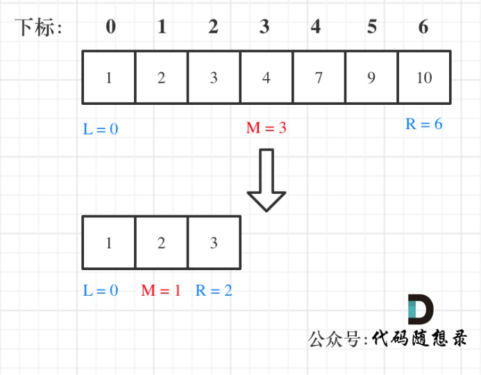

# 数组-1

##  Day 1 - 任务描述

### 任务目标

数组理论基础，#704. 二分查找，#27. 移除元素  

### 详细任务

1. 数组理论基础

- 文章链接： 

	[[https://programmercarl.com/%E6%95%B0%E7%BB%84%E7%90%86%E8%AE%BA%E5%9F%BA%E7%A1%80.html](https://programmercarl.com/数组理论基础.html)]

- 了解一下数组基础，以及数组的内存空间地址

	

2.  #704. 二分查找

- 有时间刷一下：#35.搜索插入位置 和 #34. 在排序数组中查找元素的第一个和最后一个位置。

- 文章链接： 

	[[https://programmercarl.com/0704.%E4%BA%8C%E5%88%86%E6%9F%A5%E6%89%BE.html](https://programmercarl.com/0704.二分查找.html)]


3. #27. 移除元素

- 暴力的解法，可以锻炼一下我们的代码实现能力，建议先把暴力写法写一遍。 双指针法 是本题的精髓，今日需要掌握，至于拓展题目可以先不看。 

- 文章链接：

	[[https://programmercarl.com/0027.%E7%A7%BB%E9%99%A4%E5%85%83%E7%B4%A0.html](https://programmercarl.com/0027.移除元素.html)]


## 1. 【Day-1】704 二分查找

### 1.1. 题目描述与示例

给定一个 n 个元素有序的（**升序**）整型数组 nums 和一个目标值 target  ，写一个函数搜索 nums 中的 target，如果目标值存在返回下标，否则返回 -1 。

示例1： 

```tex
输入: nums = [-1,0,3,5,9,12], target = 9     
输出: 4       
解释: 9 出现在 nums 中并且下标为 4  
```

示例2：

```tex
输入: nums = [-1,0,3,5,9,12], target = 2
输出: -1
解释: 2 不存在 nums 中因此返回 -1
```

### 1.2.  二分查找的前提条件

- **数组为有序数组**
- **数组中无重复元素** （因为一旦有重复元素，使用二分查找法返回的元素下标可能不是唯一的）

### 1.3. 二分查找的逻辑



### 1.4. 代码

```python
class Solution:
    def search(self, nums: List[int], target: int) -> int:
        length = len(nums)
        # 设置一个区间范围：
        left = 0
        right = length - 1
		
        # 检查区间是否有效
        while left <= right:
            # 取中间数:
            mid = left + (right - left) // 2 #这样计算是为了防止溢出，如果 left 和 right 都是非常大的正整数，那么 left + right 可能会超过整数的最大值，从而导致整数溢出。这种情况在某些编程语言和环境中是可能发生的，特别是在整数有固定大小的环境中，如 C++ 或 Java。
            if nums[mid] == target:
                print(mid)
                return mid
                break
            elif nums[mid] < target:
                left = mid + 1
            else:
                right = mid - 1
            
        return -1
```

### 1.5. 复杂度：

- 时间复杂度： O(log n)
- 空间复杂度：O(1)


## 2. 【Day-1】27 移除元素

### 2.1. 题目描述与示例

给你一个数组 nums 和一个值 val，你需要 原地 移除所有数值等于 val 的元素，并返回移除后数组的新长度。

不要使用额外的数组空间，你必须仅使用 O(1) 额外空间并**原地**修改输入数组。

元素的顺序可以改变。你不需要考虑数组中超出新长度后面的元素。

示例1：

```tex
给定 nums = [3,2,2,3], val = 3
函数应该返回新的长度 2, 
并且 nums 中的前两个元素均为 2

不需要考虑数组中超出新长度后面的元素。
```

示例2：

```tex
给定 nums = [0,1,2,2,3,0,4,2], val = 2
函数应该返回新的长度 5, 
并且 nums 中的前五个元素为 0, 1, 3, 0, 4
```

### 2.2. 思路：双指针法

首先，必须要清楚，对于数组的元素在内存地址中是连续的，不能单独删除数组中的某个元素，只能覆盖。

双指针的思路： **通过一个快指针和慢指针在一个for循环下完成两个for循环的工作。**

- 快指针：寻找新数组的元素 ，新数组就是不含有目标元素的数组
- 慢指针：指向更新 新数组下标的位置

###  2.3. 代码 ：

```python
（版本二）双指针代码
class Solution:
    def removeElement(self, nums: List[int], val: int) -> int:
        #双指针解法
        fast_index = 0 #寻找新数组的元素 ，新数组就是不含有目标元素的数组 
        slow_index = 0 #指向更新 新数组下标的位置
        size = len(nums)
        while fast_index < size: # fast_index 扫描完全部的nums，循环就可以结束了
            if nums[fast_index] != val:
                nums[slow_index] = nums[fast_index]
                slow_index += 1
            fast_index += 1
        # print(nums[0:count])
        # print(slow_index)
        return slow_index
```

```python
（版本二）暴力法
class Solution:
    def removeElement(self, nums: List[int], val: int) -> int:
        i, l = 0, len(nums)
        while i < l:
            if nums[i] == val: # 找到等于目标值的节点
                for j in range(i+1, l): # 移除该元素，并将后面元素向前平移
                    nums[j - 1] = nums[j]
                l -= 1 # 此时更新的length都要减去1
                i -= 1 # 此时因为lenth更改了，所以索引也需要进行相应的更改
            i += 1
        return l
```

### 2.4. 复杂度 (双指针解法）

- 时间复杂度：O(n)
- 空间复杂度：O(1)

 

